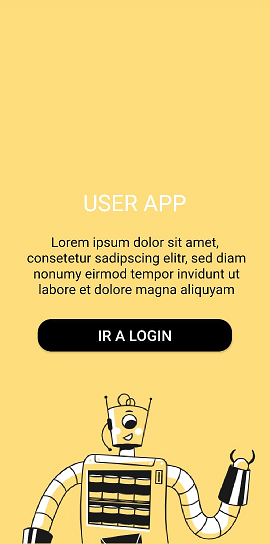

# UserApp

App developed in Flutter. You need activate permission for ubication services if you want use, you must ingress password in login with 7 numbers and the users data is get from Graphql.

## Getting Started

This project is a starting point for a Flutter application.

A few resources to get you started if this is your first Flutter project:

- [Lab: Write your first Flutter app](https://flutter.dev/docs/get-started/codelab)
- [Cookbook: Useful Flutter samples](https://flutter.dev/docs/cookbook)

For help getting started with Flutter, view our
[online documentation](https://flutter.dev/docs), which offers tutorials,
samples, guidance on mobile development, and a full API reference.

## Home Page

You must accept permission for location service when you push "IR A LOGIN" foe access to Login Page.

## Login Page

You must ingress your password with 7 numbers for access to User Page.

 

### Login Denied // Login Ok

  

## User Page

Data for User Page is from GraphQL.

## Video Demostration

Enjoy!
